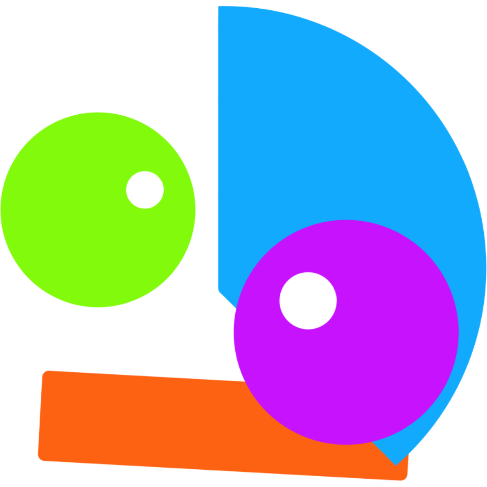
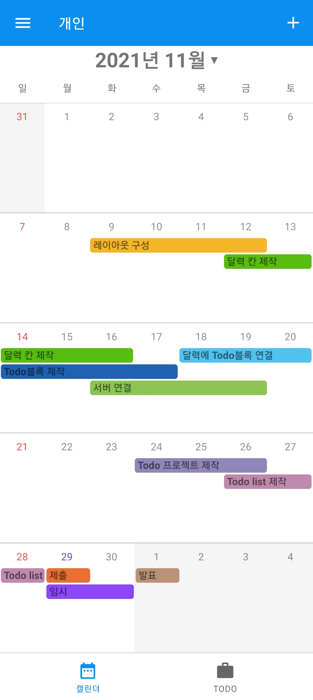
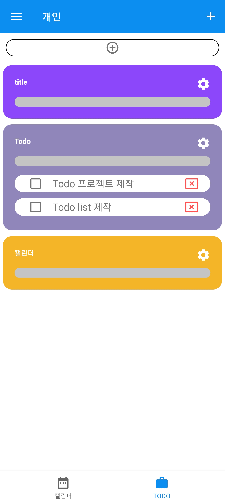

# DID

-   실행 환경 : Android compileSdkVersion 30 (minSdkVersion 29)
-   프론트 개발 언어 : Kotlin
-   프론트 UI, UX: Figma
    
-   백엔드 개발 언어 : JS
-   백엔드 프레임워크 : Node.JS
-   데이터베이스 : MongoDB, Firebase
-   서버 배포 : Heroku
    
-   협업 툴 : GitHub, ZOOM

***
### 주의
-   테스트시 firebase 사용을 위한 SHA-1를 자신의 프로젝트에 맞게 설정해야함.
-   서버와의 통신 속도때문에 화면 갱신이 늦을 수 있음.
***

## 협업의 효율적인 일정 관리

Calendar View

    -   팀의 일정을 블록 형태로 볼 수 있는 달력입니다. 다양한 색을 사용할 수 있습니다.

TodoList View

    -   팀의 프로젝트를 볼 수 있는 화면입니다. 프로젝트 위젯으로 제목, 공정률을 볼 수 있으며 위젯을 클릭하면 해당 프로젝트의 Todo List가 보입니다.